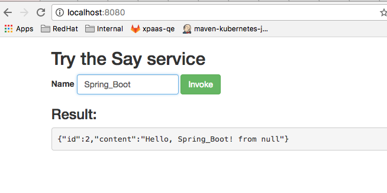
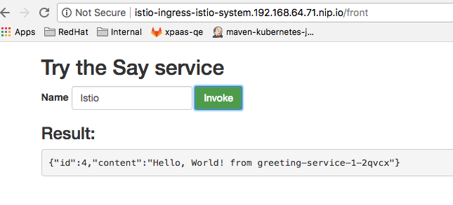

Table of Contents
=================

   * [Instructions to play with Say and Greeting Spring Boot Microservices](#instructions-to-play-with-say-and-greeting-spring-boot-microservices)
   * [Locally](#locally)
   * [On OpenShift](#on-openshift)
   * [On OpenShift using Istio Service Mesh](#on-openshift-using-istio-service-mesh)
      * [Instructions](#instructions)
      * [All in one instructions](#all-in-one-instructions)


# Instructions to play with Say and Greeting Spring Boot Microservices 

This Quickstart contains 3 Spring Boot applications. A static front application that you can use to send a message. Then this application will issue at the backend side a REST request to 
call the `Say` service which also itself will call the `Greeting` service by issuying a REST call. 
The project can be used locally and launched using Spring Boot Maven plugin or deployed on OpenShift.

To support multiple environments, 2 maven profiles have been defined and will be used to pass the endpoint of the greeting service
within the `application.yaml` file. The `development` profile is used when the application is launched locally using Spring Boot Maven plugin while the `openshift` profile will be used when the `Say` application is running on OpenShift. 

## Locally

- Frontend Service
```bash
cd frontend
mvn clean package spring-boot:run
```

- Greeting Service
```bash
cd greeting-service
mvn clean compile spring-boot:run
```

- Say Service
```bash
cd say-service
mvn clean compile spring-boot:run
```

- Open the Frontend within your browser `http://localhost:8080` and invoke the service !



## On OpenShift using Istio ServiceMesh

The following instructions will let you to install  3 Spring Boot applications top of the Istio ServiceMesh where the frontend application will be exposed outside of the cluster 
using an OpenShift route. Under the hood, the frontend application will issue REST calls to access the `Say` service which will also call the `Greeting` service using their respective Service Name
and internal ingress routes.

Remark : Due to a limitation of the ingress definition, an Istio `RouteRule` must be defined in order to rewrite the `/front` URL to `/` when the front end is accessed !

When, an external HTTP client will open the url of the frontend URL `http://istio-ingress-istio-system.192.168.64.71.nip.io/front` and next click on the `invoke` button within the web page,
then a HTTP request will be propagated to the  `http://say-service/say` endpoint and next to the `http://greeting-service/greeting` service. The greeting service will populate the response which is 
returned back and displayed within the static index.html page

To configure our Spring Boot applications as member of the Istio ServiceMesh, we will then configure the `Fabric8 Maven Plugin` to use the `istio-enricher` module. This module
will enrich the `DeploymentConfig` yaml resource in order to add the istio `init_cotnainer` and `istio_proxy`.


Remarks: 

- This project has been tested against Istio 0.2.12, 0.3.0 and 0.4.0. 
- When you use the `Fabric8 Maven plugin` and the `Istio enricher`, then it is not longer required to use the `istioctl` client!

### Instructions 

Follow these instructions to play with Istio and the different services

1. Install Istio using the [Ansible playbook](https://github.com/istio/istio/blob/master/install/ansible/README.md) top of minishift, minikube or an openshift cluster (version >= 3.7)

2. Create a new OpenShift namespace `demo-istio`. Add the `privileged` security constraint to the `default` service account user
used to authenticate the pod with OpenShift.

*Note*: you need to log into OpenShift using an admin account (`admin/admin` by default on minishift) because Istio deployment needs access to the `istio-system` namespace. 

```bash
oc new-project demo-istio
oc adm policy add-scc-to-user privileged -z default -n demo-istio
```

3. Deploy the 3 MicroServices. 

```bash
mvn clean package fabric8:deploy -Pistio-openshift
```

4. Access the `Say` service using the Istio Ingress/Proxy

In order to access the service, it is required first to expose the Istio Ingress proxy behind an external route that your machine can access using its hostname.
Then, execute this command

```bash
oc expose svc istio-ingress -n istio-system
```

5. Open the front route within your web browser using the route address of the istio ingress

You can get the route address using the following `oc` command

```bash
oc get route/istio-ingress -n istio-system
NAME            HOST/PORT                                         PATH      SERVICES        PORT      TERMINATION   WILDCARD
istio-ingress   istio-ingress-istio-system.192.168.64.71.nip.io             istio-ingress   http                    None
```



Then, you can also access the service using the address of the service exposed by the Ingress Proxy

```bash
export SAY_URL=$(minishift openshift service istio-ingress -n istio-system --url)/say
curl $SAY_URL

or 

http -v $SAY_URL
GET /say HTTP/1.1
Accept: */*
Accept-Encoding: gzip, deflate
Connection: keep-alive
Host: istio-ingress-istio-system.192.168.64.26.nip.io
User-Agent: HTTPie/0.9.9


HTTP/1.1 200 OK
Cache-control: private
Set-Cookie: 144852ee66f5cb84d6e58f9bcce52825=d8dd521a887ff43f55e011dcd3d9caec; path=/; HttpOnly
content-type: application/json;charset=UTF-8
date: Wed, 06 Dec 2017 12:51:38 GMT
server: envoy
transfer-encoding: chunked
x-envoy-upstream-service-time: 63

{
    "content": "Hello, World!",
    "id": 6
}

```

Enjoy this first **Istio** and **Spring Boot** Developer Experience !!

## All in one instructions

The commands to be executed have been designed as a all in one guide !

Remark : To switch from an istio version to another, then use the `sed -i.bk s//g` instructions as defined here after.
They will allow to change the Fabric8 Maven Plugin profile of the quickstarts.

```bash
echo "Create a Minishift VM" 
minishift profile set istio
minishift --profile istio config set memory 4GB
minishift --profile istio config set openshift-version v3.7.1
minishift --profile istio config set vm-driver xhyve
minishift --profile istio addon enable admin-user
minishift start --profile istio
echo "Log to OpenShift and create a demo project"
oc login $(minishift ip):8443 -u admin -p admin

pushd $(mktemp -d)
echo "Git clone ansible project to install istio distro, project on openshift"
git clone https://github.com/istio/istio.git && cd istio/install
ansible-playbook ansible/main.yml -e '{"cluster_flavour": "ocp","istio": {"release_tag_name": "$ISTIO_VERSION", "auth": false}}'
cd ..

echo "Sleep at least 5min to be sure that all the docker images of istio will be downloaded and istio deployed"
sleep 5m
git clone git@github.com:snowdrop/spring-boot-quickstart-istio.git && cd spring-boot-quickstart-istio
#sed -i.bk 's/istioVersion: \"0.3.0\"/istioVersion: \"0.4.0\"/g' greeting-service/src/main/istio/profiles.yml
#sed -i.bk 's/istioVersion: \"0.3.0\"/istioVersion: \"0.4.0\"/g' say-service/src/main/istio/profiles.yml

oc new-project demo-istio
oc adm policy add-scc-to-user privileged -z default -n demo-istio

mvn clean package fabric8:deploy -Pistio-openshift

sleep 30s
oc create -f rules/frontend/route-rule-redir.yml
oc expose svc istio-ingress -n istio-system

export SAY_URL=$(minishift openshift service istio-ingress -n istio-system --url)/say
http -v $SAY_URL
popd
```